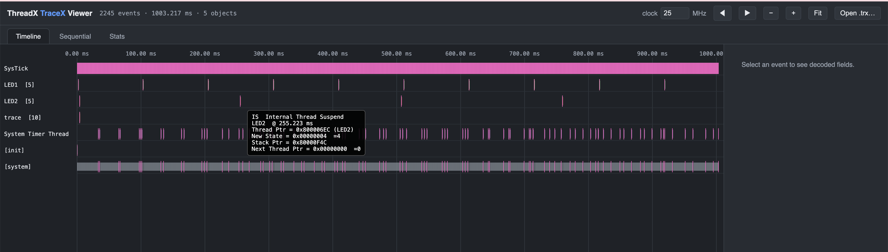

# ThreadX TraceX Viewer

A lightweight, zero-dependency, in-browser viewer for ThreadX TraceX (`.trx`) trace files. No install, no build step, no server — just open an HTML file and drop in a trace.

## Features

- **Timeline** — interactive, canvas-based swimlane view of threads, ISRs, and SysTick, with zoom/pan and hover tooltips showing decoded event fields.
- **Sequential** — every event as a flat, scrollable table.
- **Stats** — CPU time per thread, context-switch count, object registry, and event-type histogram.

All three views are driven by a single parsed trace, so switching tabs or adjusting the clock frequency is instant — no re-parsing or network round-trips.

## Usage

1. Open `TraceViewer/TraceX.html` in any modern browser.
2. Drag and drop a `.trx` file onto the page, or click **Open .trx…**.
3. If the trace's timer frequency isn't 25 MHz, update the `clock` field — timestamps rescale immediately.
4. Switch between the **Timeline**, **Sequential**, and **Stats** tabs; click any event to see its fully decoded fields in the details panel.

A ready-to-use sample trace, `trace_example.trx`, is included at the repo root — drop it in to try the viewer immediately.

## Repository structure

- `TraceViewer/TraceX.html` — the viewer app (markup, styling, and all logic).
- `TraceViewer/events.js` — generated table of ThreadX event IDs → names/icons/colors/field labels.
- `trace_example.trx` — sample trace file for testing.
- `images/viewer.png` — screenshot shown above.
